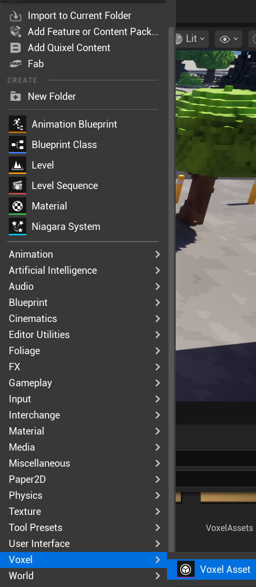
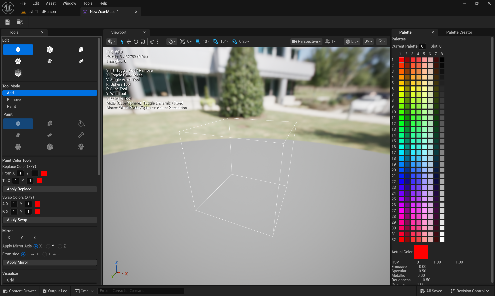

# Getting Started

This section describes the basic workflow for creating, editing, and using voxel assets.

---

## Creating a Voxel Asset

1. Open the Content Browser
2. Create a new **Voxel Asset**
3. Name the asset and open it

Opening the asset launches the **Voxel Asset Editor**, which provides a dedicated viewport and toolset.

---

## Editing the Asset

Inside the Voxel Asset Editor:
- Use **Edit Tools** to create and modify voxel geometry
- Use **Paint Tools** to assign palette colors
- Configure palette slots and material parameters

Changes are stored directly in the Voxel Asset.

---

## Placing the Asset in the Level

- Drag the Voxel Asset into the Level
- A dedicated **Voxel Actor** is created automatically
- The actor contains a **Voxel Component** responsible for rendering and runtime logic

---

## Runtime Interaction

At runtime, the voxel asset supports:
- Destruction and damage
- Partial rebuilds
- Optional static mesh proxy rendering

All runtime operations are exposed via Blueprint functions.

---

## Typical Workflow Summary

1. Create and edit a Voxel Asset
2. Configure palette and materials
3. Place the asset in the Level
4. Use Blueprint functions to interact with voxels at runtime
5. Optimize using streaming and baked proxies when needed
