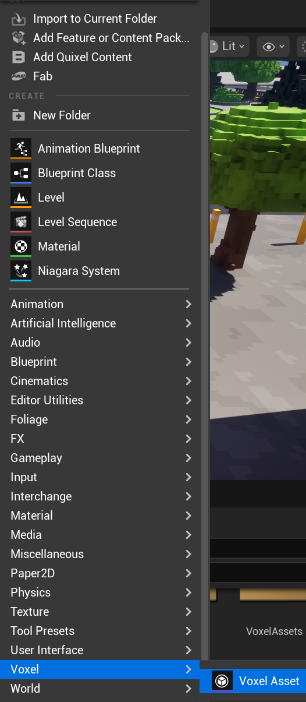
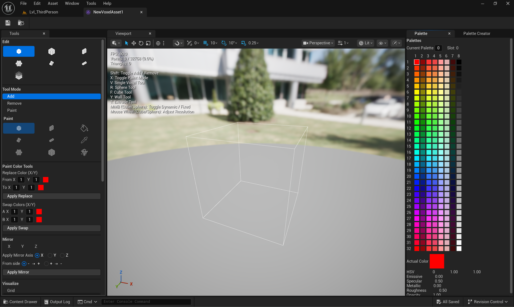

# Getting Started

This section describes the basic workflow for creating, editing, saving, and using voxel assets in VE 1.2.0.

## Creating a Voxel Asset

1. Open the Content Browser.
2. Create a new Voxel Asset.
3. Name the asset and open it.

Opening the asset launches the Voxel Asset Editor, which provides a dedicated viewport, voxel editing tools, palette controls, import/export actions, and bake support.

## Editing the Asset

Inside the Voxel Asset Editor:

- Use Edit Tools to create and modify voxel geometry.
- Use Paint Tools to assign palette slots.
- Use Palette Creator to edit palette colors and material extras.
- Save the asset to rebuild its baked StaticMesh proxy and editor anchor.

Voxel occupancy and palette indices are stored in the Voxel Asset. VE 1.2.0 stores occupancy separately from palette index data, so palette slot 255 is a valid painted slot instead of being reserved as the empty marker.

## Project Settings First Pass

Before placing many assets in a level, review Project Settings > Voxel Editor:

- Default Voxel Size controls the world size of each voxel and triggers asset/component updates when changed.
- Use Nanite Runtime Rendering selects the runtime rendering backend and requires an editor restart.
- Runtime Sparse Pipeline controls edit chunk size, shared visual cluster size, and per-frame override budgets.
- Standard StaticMesh Streaming options are only used when Nanite runtime rendering is disabled.

The demo project currently enables Nanite runtime rendering.

## Placing the Asset in the Level

- Drag the Voxel Asset into the level.
- A Voxel Actor is created automatically.
- The actor owns a Voxel Component responsible for runtime rendering, collision, destruction, damage, and save/load.

## Runtime Interaction

At runtime, the component uses the sparse pipeline:

- Pristine instances share a template built from the source Voxel Asset.
- Runtime edits create local sparse overrides for only the affected instance.
- Edited clusters are rebuilt incrementally using the configured runtime budget.
- Save/load stores only removed cells, damaged cells, remaining health, and complete-component destruction state.

All gameplay-facing runtime operations are exposed through Blueprint functions.

## Typical Workflow Summary

1. Create and edit a Voxel Asset.
2. Configure palette slots, material extras, and optional custom material.
3. Save the asset so the baked StaticMesh proxy is rebuilt.
4. Choose Standard StaticMesh or Nanite runtime rendering in Project Settings.
5. Place the asset in the level.
6. Use Blueprint functions to delete, damage, save, or load voxels at runtime.
7. Tune sparse cluster sizes, override budgets, and streaming options for the target level.
