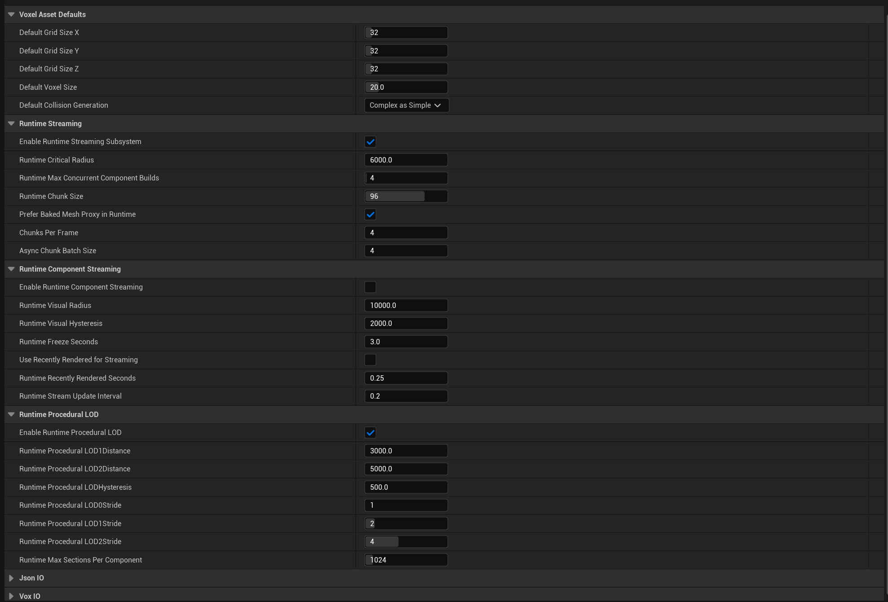
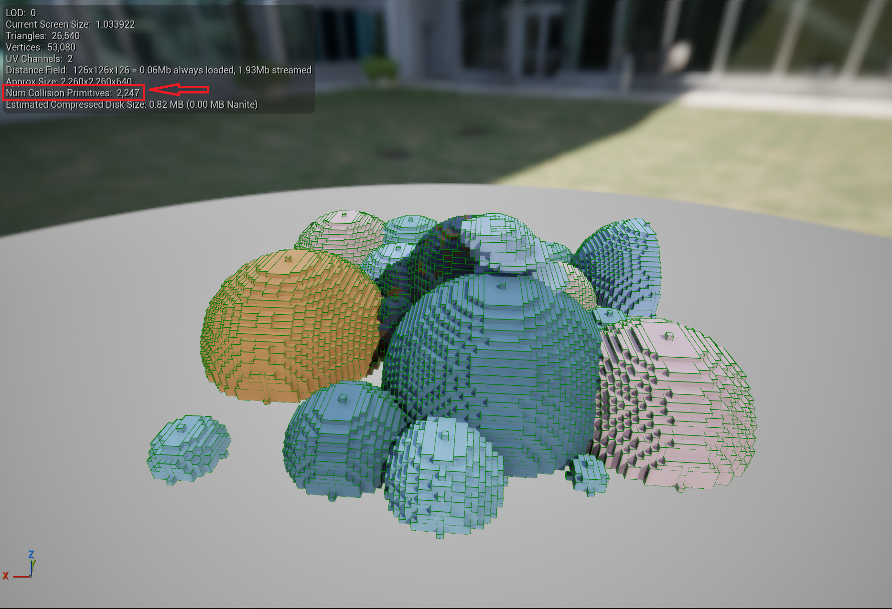
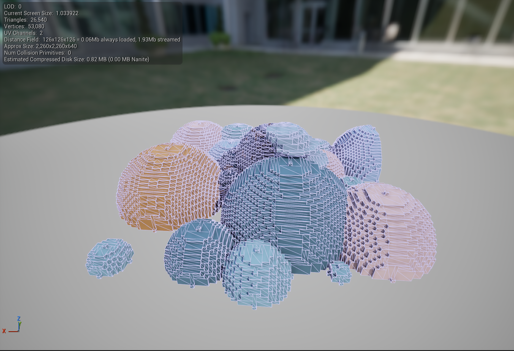
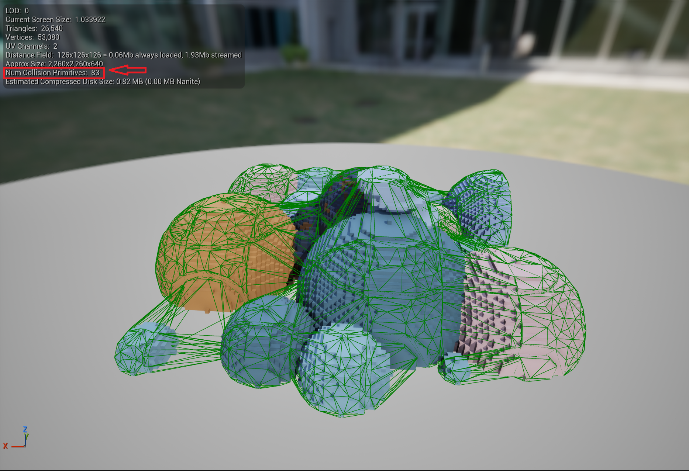

# Project Settings

The plugin exposes multiple project-level settings that control defaults, runtime behavior, and performance.

All settings are located under **Project Settings → Voxel Editor**.

---

## Voxel Asset Defaults

These settings define defaults when creating new Voxel Assets.

- **Default Grid Size X/Y/Z**  
  Initial voxel grid dimensions

- **Default Voxel Size**  
  World-space size of a single voxel in unreal units
  Edit this, affect all Assets and force rebuild for all components on project
  
- **Default Collision Generation**
  Collision to be generated by the voxel asset, the choice of collision greatly affects the performance in the project, observe the types in the images below, the approximate method has a good balance between precision and performance, but since voxels have a well-defined cubic shape, perhaps Complex is the best form of collision available.
  Whenever you change this option, you need to save the Voxel assets again so that the change is applied to the Proxy.
  
  	
  
  

---

## Runtime Streaming

Controls the global streaming and rebuild scheduler.

- **Enable Runtime Streaming Subsystem**  
  Enables the global voxel rebuild scheduler

- **Runtime Critical Radius**  
  Radius around the player where voxel components are considered critical

- **Runtime Max Concurrent Component Builds**  
  Limits how many voxel components can rebuild simultaneously

- **Runtime Chunk Size**  
  Size of voxel chunks used during procedural mesh generation

- **Prefer Baked Mesh Proxy in Runtime**  
  Uses baked static meshes when available instead of procedural meshes
  Enabling this option may be useful if you have many assets with large grids that will not be easily modified.

---

## Runtime Component Streaming

Controls distance-based visual streaming and update throttling for voxel components.

- **Enable Runtime Component Streaming**  
  Enables distance-based visual streaming for voxel components.

- **Runtime Visual Radius**  
  Maximum distance at which a voxel component remains visually active.

- **Runtime Visual Hysteresis**  
  Additional distance buffer to prevent frequent enable and disable toggling near the visual radius.

- **Runtime Freeze Seconds**  
  Minimum time a component must remain in its current streaming state before another state change is allowed.

- **Use Recently Rendered for Streaming**  
  Uses recently rendered information to influence streaming decisions.

- **Runtime Recently Rendered Seconds**  
  Time window during which a component is considered recently rendered.
  Only used if Use Recently Rendered for Streaming is enabled.

- **Runtime Stream Update Interval**  
  Interval in seconds between streaming evaluation passes.

## Runtime Procedural LOD

Controls distance-based procedural LOD reduction for voxel components at runtime.

- **Enable Runtime Procedural LOD**  
  Enables procedural level of detail reduction for voxel components.

- **Runtime Procedural LOD1 Distance**  
  Distance at which the first procedural LOD level becomes active.

- **Runtime Procedural LOD2 Distance**  
  Distance at which the second procedural LOD level becomes active.

- **Runtime Procedural LOD Hysteresis**  
  Additional distance buffer to prevent frequent LOD switching near distance thresholds.

- **Runtime Procedural LOD0 Stride**  
  Voxel sampling stride for LOD0.
  A value of 1 means full resolution.

- **Runtime Procedural LOD1 Stride**  
  Voxel sampling stride for LOD1.
  Higher values reduce detail and generation cost.

- **Runtime Procedural LOD2 Stride**  
  Voxel sampling stride for LOD2.
  Used for distant components.

- **Runtime Max Sections Per Component**  
  Maximum number of mesh sections allowed per voxel component.
  Prevents excessive section generation.

## Guidelines

- Larger chunk sizes reduce draw calls but increase rebuild cost
- Limiting concurrent builds prevents CPU spikes
- Baked mesh proxies are recommended for large static assets
