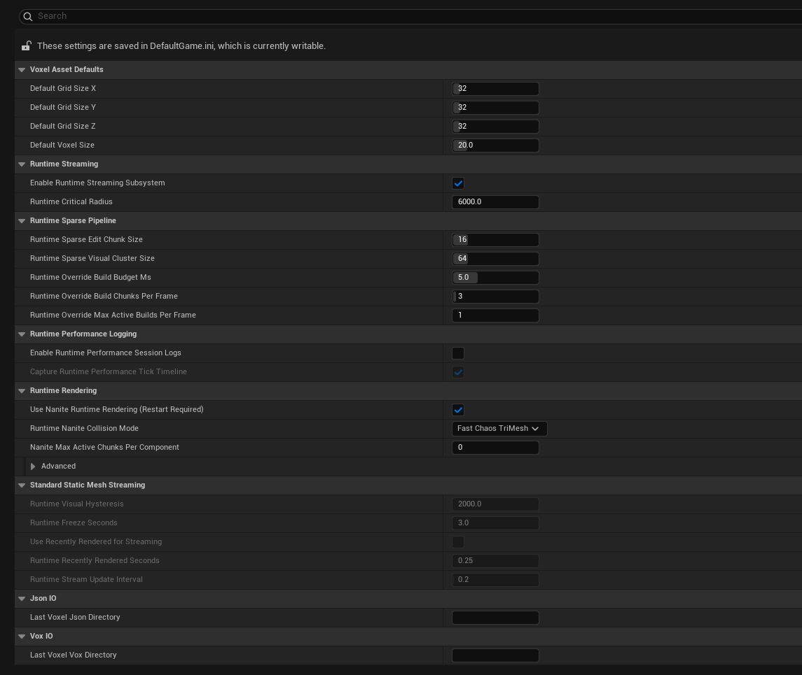
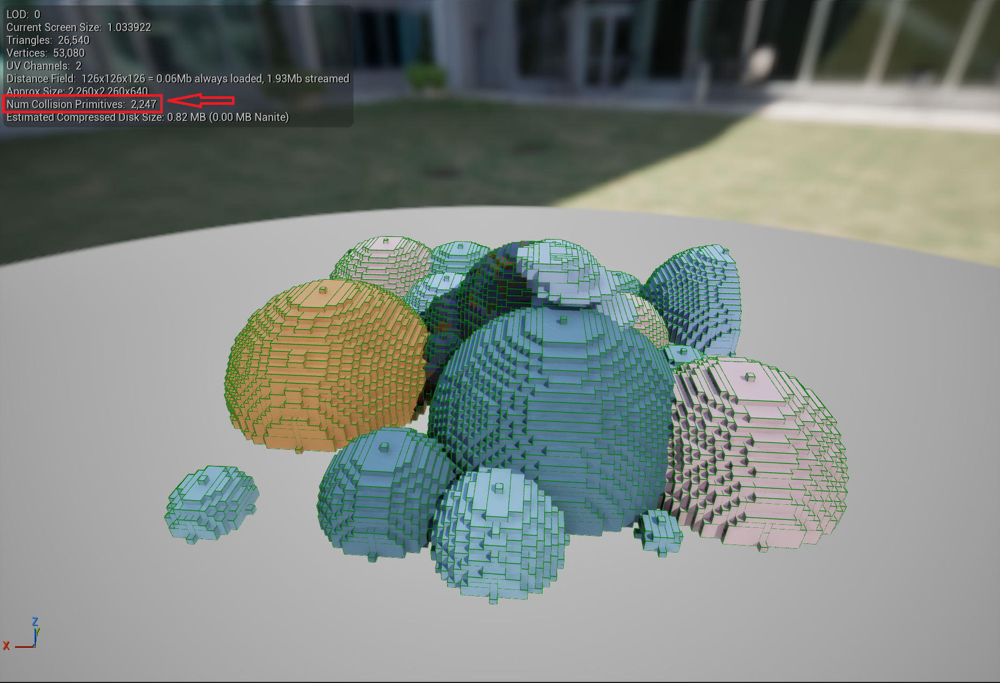
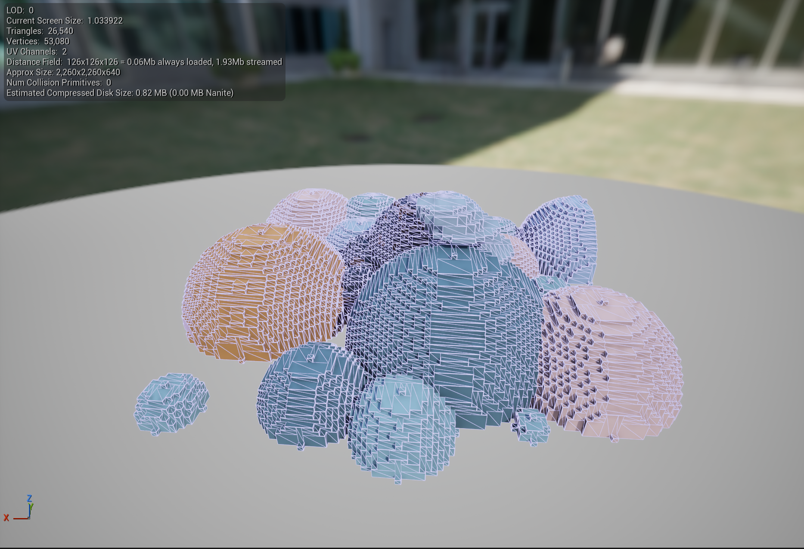
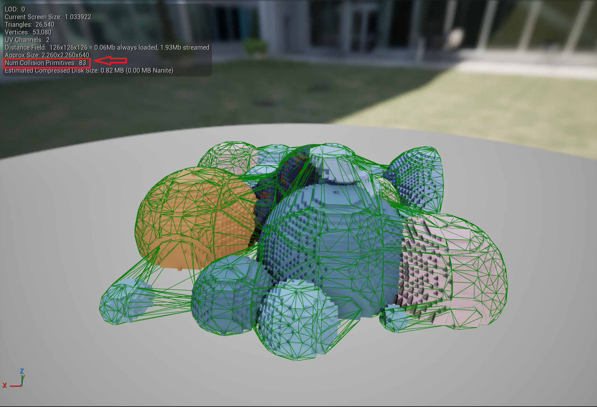

# Project Settings

The plugin exposes project-level defaults under Project Settings > Voxel Editor.

These settings control new asset defaults, runtime rendering, sparse edit behavior, collision, streaming, performance logging, and import/export directories.

## Voxel Asset Defaults

These settings define defaults used by new Voxel Assets and runtime components.

- Default Grid Size X/Y/Z: Initial voxel grid dimensions for newly created assets.
- Default Voxel Size: World-space size of one voxel in Unreal units. Changing it updates Voxel Assets and refreshes editor/runtime visuals. Baked mesh data is rescaled and rebuilt when required.
- Default Collision Generation: Collision mode for the Standard StaticMesh runtime backend. This setting is editable and triggers rebuilds only when Nanite runtime rendering is disabled.

Default Collision Generation options:

- Simple Boxes: Generates merged box collision from voxel occupancy.
- Complex as Simple: Uses the generated surface as complex collision.
- Approximate Surface: Builds an approximate surface collision representation.

Changing Default Collision Generation rebuilds baked voxel StaticMeshes when the Standard StaticMesh backend is active. Save all affected assets after the rebuild finishes.

## Runtime Rendering

Runtime Rendering selects the backend used by shared runtime visual clusters and baked editor anchors.

- Use Nanite Runtime Rendering (Restart Required): Enables the Nanite runtime backend. Changing this option marks Runtime Rendering Rebuild Pending and requires an editor restart.
- Runtime Rendering Rebuild Pending: Internal read-only flag indicating that baked voxel anchors will be rebuilt on the next editor startup.
- Runtime Nanite Collision Mode: Collision mode used while Nanite runtime rendering is active.
- Nanite Max Active Chunks Per Component: Safety cap for transient Nanite chunk visuals on one Voxel Component. A value of 0 means unlimited.

When Nanite runtime rendering is enabled:

- Shared visual clusters and baked editor anchors use Nanite.
- Standard distance visibility streaming does not hide assets by radius; Nanite manages visual streaming.
- Default Collision Generation is ignored by runtime Nanite collision.
- Fast Chaos TriMesh builds collision directly from voxel chunk triangles when Runtime Nanite Collision Mode is enabled.

When Nanite runtime rendering is disabled:

- Shared runtime visuals and baked anchors use standard StaticMesh rendering.
- Standard StaticMesh streaming settings control distance visibility and freezing behavior.
- Default Collision Generation controls generated collision.

## Runtime Sparse Pipeline

The sparse occupied-voxel runtime pipeline is the only runtime data pipeline in VE 1.2.0. Grid size remains an editor and bounds limit, while runtime edits operate on sparse occupied cells and local overrides.

- Runtime Sparse Edit Chunk Size: Small chunk size used for sparse edit lookup and local instance overrides.
- Runtime Sparse Visual Cluster Size: Larger cluster size used for shared runtime visual/collision and per-instance visual overrides.
- Runtime Override Build Budget Ms: CPU budget per frame for local visual/collision override work after runtime edits.
- Runtime Override Build Chunks Per Frame: Maximum local edit chunks attempted per frame.
- Runtime Override Max Active Builds Per Frame: Maximum components allowed to process pending local override work in the same frame.

Lower edit chunk sizes make edits more granular. Larger visual clusters reduce component count for pristine instances but increase the amount of geometry affected when an edited cluster needs to be updated.

## Runtime Streaming

Runtime Streaming controls Standard StaticMesh distance visibility streaming. These options are still shown when Nanite is active, but Nanite bypasses the distance hide/unhide path.

- Enable Runtime Streaming Subsystem: Enables Standard StaticMesh distance visibility streaming.
- Runtime Critical Radius: Radius around player pawns where Standard StaticMesh voxel components remain visually active.

When Nanite runtime rendering is enabled, the subsystem keeps previously hidden or frozen components visible again and lets Nanite handle visual streaming.

## Standard StaticMesh Streaming

These options apply only when Use Nanite Runtime Rendering is disabled.

- Runtime Visual Hysteresis: Extra distance buffer used to avoid frequent load/unload toggling near the visual radius.
- Runtime Freeze Seconds: Time without edits before a diverged local override component can freeze.
- Use Recently Rendered for Streaming: Uses WasRecentlyRendered checks to downgrade or freeze off-screen components.
- Runtime Recently Rendered Seconds: Time window for WasRecentlyRendered checks.
- Runtime Stream Update Interval: Interval between streaming evaluation passes.

Runtime stream states are:

- Hidden By Standard Streaming
- Shared Sparse Visible
- Local Override Visible
- Local Override Frozen

Pristine components can use the shared sparse visual state. Components with runtime edits are marked as diverged and use local override states until they are reset by load or gameplay logic.

## Runtime Performance Logging

- Enable Runtime Performance Session Logs: Writes a compact runtime performance report to Saved/VoxelEditor/PerformanceLogs when a PIE session stops.
- Capture Runtime Performance Tick Timeline: Includes per-tick timeline entries in the session log. Final averages are still collected when this option is disabled.

Runtime logs are opt-in in the default project profile.

## Import/Export Directories

- Last Voxel Json Directory: Last directory used by JSON import/export dialogs.
- Last Voxel Vox Directory: Last directory used by MagicaVoxel .vox import/export dialogs.

These values are stored in project configuration to make repeated import/export work faster.

## Guidelines

- Use Nanite runtime rendering for large static or mostly-static voxel environments.
- Use Standard StaticMesh rendering when explicit distance visibility streaming is more important than Nanite rendering.
- Increase Runtime Sparse Visual Cluster Size to reduce shared component count.
- Lower Runtime Sparse Edit Chunk Size when destruction needs to affect smaller regions.
- Keep Runtime Override Build Budget Ms conservative for gameplay-heavy scenes.
- Save all Voxel Assets after changing rendering or collision settings that trigger baked proxy rebuilds.
