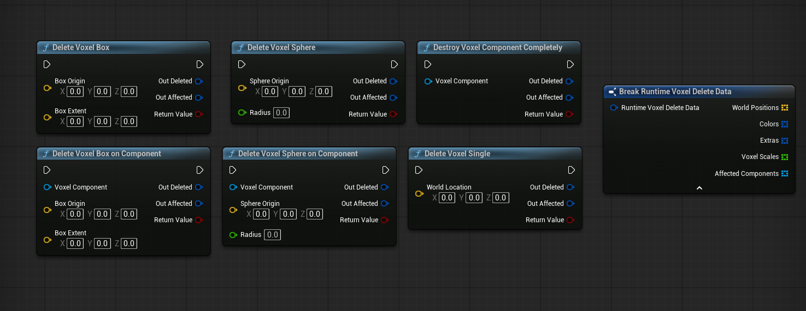
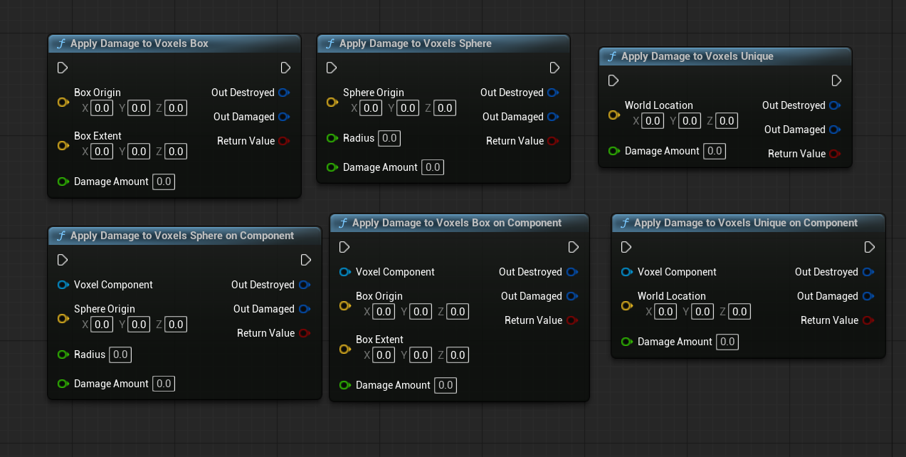
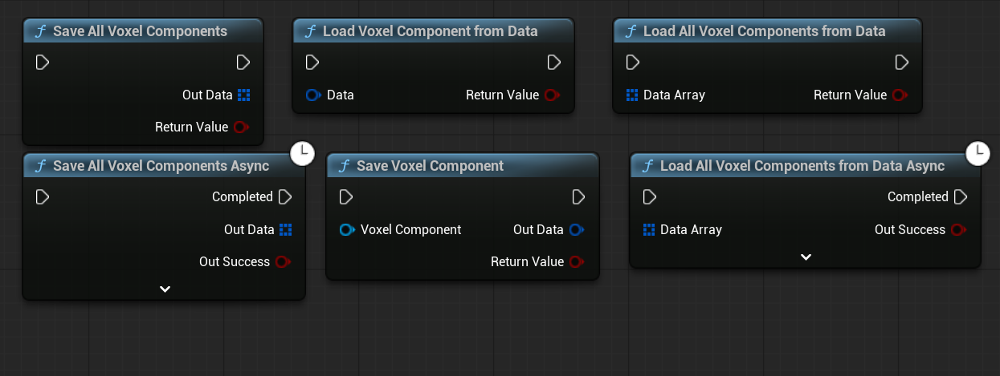
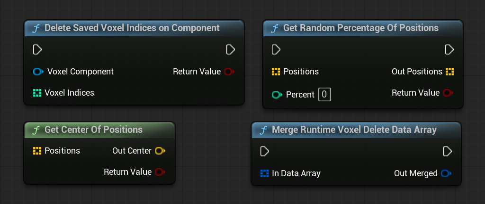

# Blueprint API

The plugin exposes a comprehensive Blueprint API for runtime voxel interaction.

All voxel operations at runtime are performed through the **Voxel Component** using Blueprint-accessible functions.

---

## Blueprint Usage Notes

Blueprint actors can own and interact with a **Voxel Component** directly.

However, **Blueprints cannot use or access the voxel runtime procedural mesh directly**.

All runtime interaction with voxel data must be done through:

- The Voxel Component
- The provided Blueprint API functions

The runtime voxel mesh is an internal implementation detail and is not to be used in Blueprints.

- Rendering, streaming, and mesh updates are handled internally by the component
- Direct access to mesh data is intentionally restricted for safety and performance

---

## Deletion Functions

Deletion functions remove voxels instantly without applying damage.

Supported operations include:
- Delete single voxel
- Delete box region
- Delete sphere region
- Component-specific variants

Deletion functions return detailed information about affected voxels and components.

---

## Damage Functions

Damage functions apply damage values to voxels before destruction.

Supported operations include:
- Apply damage to individual voxels
- Apply damage over box or sphere regions
- Automatic voxel destruction when health reaches zero

Damage functions allow gradual destruction and gameplay-driven effects.

---

## Save and Load Functions

Save and load functions allow capturing and restoring voxel destruction state at runtime.

These functions are designed to:
- Persist voxel modifications
- Restore destroyed or damaged voxels
- Avoid saving full voxel assets

Typical usage includes:
- Collecting voxel changes from active components
- Serializing only modified voxel data
- Reapplying voxel destruction during load
- For the save/load function to work correctly, the subsystem must be enabled in the plugin settings.

Save and load operations are optimized to work on **delta data**, not full voxel grids.

---

## Returned Data

Deletion, damage, and save/load functions return structured runtime data, including:

- World positions of affected voxels
- Palette colors
- Extra material data
- Voxel scales (based on component or actor scale)s
- Affected voxel components

This data can be used for:
- Gameplay reactions
- Visual effects
- Save systems
- Analytics or debugging

---

## Helper Functions

Utility functions provided by the API include:

- Merging multiple runtime voxel delete data entries
- Computing the center point of voxel position arrays

These helpers simplify post-processing of voxel operations.

---

