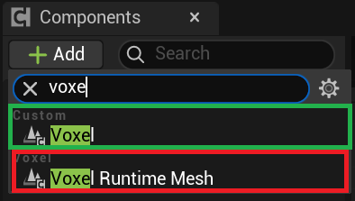
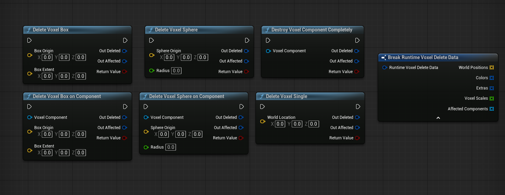
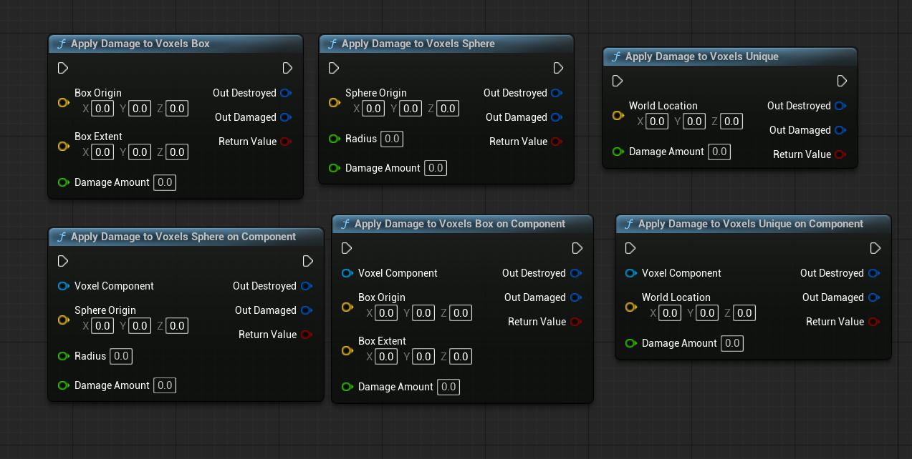
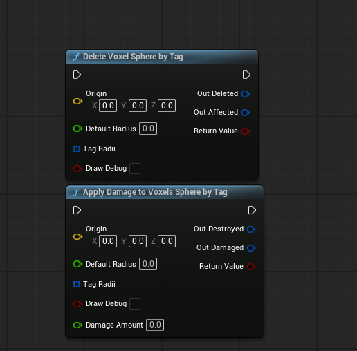
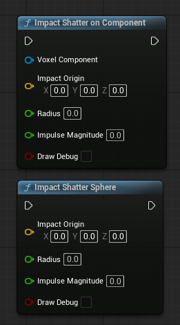
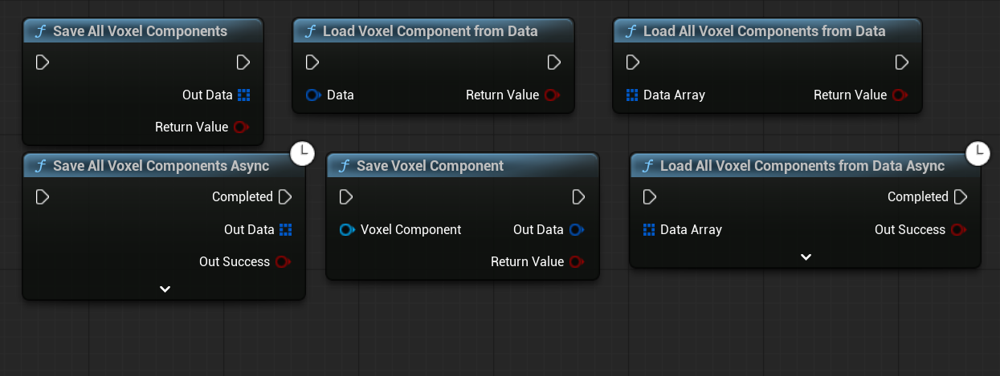
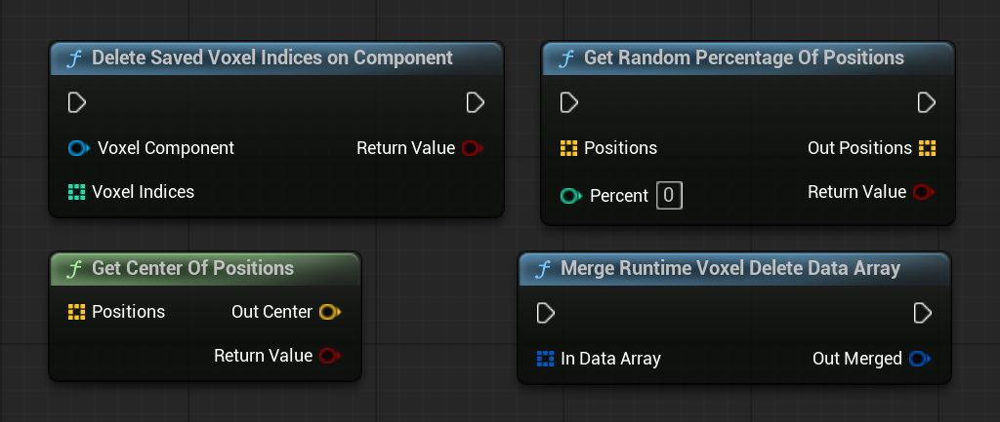

# Blueprint API

The plugin exposes Blueprint APIs for runtime voxel interaction through the Voxel Component and Voxel Runtime Blueprint Function Library.

Blueprints should interact with voxel data through these APIs. The internal runtime mesh components, sparse template cache, and generated StaticMesh/Nanite chunks are implementation details.

## Voxel Component Functions

Voxel Component exposes:

- RequestFullVoxelVisualRefresh
- RequestFullVoxelVisualRefreshAsync
- RequestVoxelRegionRefresh
- WorldToVoxel
- VoxelToWorld

Use refresh functions only when a custom system changes voxel state outside the normal runtime delete, damage, or save/load APIs.

## Deletion Functions

Deletion functions remove voxels instantly without applying damage.

Supported operations:

- DeleteVoxel_Single
- DeleteVoxel_Box
- DeleteVoxel_Sphere
- DeleteVoxel_BoxOnComponent
- DeleteVoxel_SphereOnComponent
- DestroyVoxelComponentCompletely

World-scoped functions search for intersecting Voxel Components. Component-specific functions apply the operation only to the component passed in.

Deletion functions return deleted voxel data and affected-neighbor data.

## Damage Functions

Damage functions apply damage to voxel health before removal.

Supported operations:

- ApplyDamageToVoxels_Unique
- ApplyDamageToVoxels_UniqueOnComponent
- ApplyDamageToVoxels_Box
- ApplyDamageToVoxels_BoxOnComponent
- ApplyDamageToVoxels_Sphere
- ApplyDamageToVoxels_SphereOnComponent

Damage functions return destroyed voxel data and damaged-but-still-occupied voxel data.

## Tag-Based Deletion and Damage

Tag-based nodes apply a sphere edit whose radius is chosen per actor from the actor's tags.

Supported operations:

- DeleteVoxel_SphereByTag
- ApplyDamageToVoxels_SphereByTag

Each node takes a Default Radius and an array of Tag Radius entries (Actor tag paired with a radius):

- Default Radius is used to find nearby components and is applied to any actor with no matching tag.
- For each entry in the array, actors whose owner carries that Actor tag are edited with that entry's radius instead. The first matching tag in array order wins.
- A tag radius of 0 makes that actor immune.
- Discovery uses the largest radius involved, so an actor is never missed because its tag radius reaches farther than Default Radius.

Use this to make one explosion carve different amounts out of different materials — for example a large radius against a "Weak" tag and a small one against a "Reinforced" tag.

These nodes replicate exactly like DeleteVoxel_Sphere. Tags are read locally on each machine (Actor Has Tag), so they must be identical on server and clients — use design-time tags. See [Networking and Replication](12-Networking-Replication.md).

## Impact Shatter Functions

Impact shatter nodes fracture the voxels around a point into flying shards **without a delete or damage of their own** — the impact makes the break, not a hole. Every voxel component in range shatters: small pieces crumble away as dust, larger ones fly off as simulated fragments. Use them for surface breaks a hit should scatter — a round cracking glass, a blow spalling stone — where you want the debris without carving a clean crater.

Supported operations:

- ImpactShatter_Sphere
- ImpactShatter_OnComponent

Both take an impact origin, a radius, an impulse magnitude, and a debug-draw flag. The break is shaped by the Voxel Physics > Shatter settings (shard size, shell reach, piece count, impulse, spin) — the same ones Shatter mode uses. See [Physics and Destruction](11-Physics-and-Destruction.md). They fire regardless of the object's Physics Mode, but still respect a component's physics flag, so a piece marked non-physical is never shattered.

ImpactShatter_Sphere is world-scoped and replicates: each peer reproduces the same deterministic fracture from the origin, so no fragment is sent over the wire. ImpactShatter_OnComponent targets one component directly and is local only. See [Networking and Replication](12-Networking-Replication.md).

## Voxel Structure Functions

These are on the Voxel Structure actor, not the function library. They reconfigure a multi-asset building while the game runs — one assembled by gameplay, or a piece added after the level loads.

- RebuildStructure
- AddStructureMember
- RemoveStructureMember
- GetGroundedMemberCount

Support relationships are re-derived from where the members actually are, so moving or adding a member only needs a rebuild, never a hand-authored link. See [Voxel Structures](14-Voxel-Structures.md).

## Save and Load Functions

Save/load functions capture and restore sparse runtime state.

Supported operations:

- SaveVoxelComponent
- SaveAllVoxelComponents
- LoadVoxelComponentFromData
- LoadAllVoxelComponentsFromData
- SaveAllVoxelComponentsAsync
- LoadAllVoxelComponentsFromDataAsync
- SaveAllVoxelFragments
- LoadAllVoxelFragments

Save data is delta-based. It stores removed cells, damaged cells, remaining health, and whether a component was completely destroyed.

Physics fragments are saved and loaded separately, with SaveAllVoxelFragments and LoadAllVoxelFragments. A placed voxel object stores a delta against its disk asset, but a fragment has no disk asset — its voxels exist only at runtime — so they travel inside the save data itself. Loading fragments spawns actors (the pieces are not in the level) and destroys any fragment currently in the world first, so the save is authoritative. To persist a destroyed and fragmented scene, save both the components and the fragments, and load both.

Async save/load functions spread work across frames and expose per-tick count controls:

- ActorsPerTick for async save.
- ComponentsPerTick for async load.

## Returned Delete/Damage Data

FRuntimeVoxelDeleteData contains:

- WorldPositions
- Colors
- Extras
- VoxelScales
- AffectedComponents

Use this data for hit reactions, particle spawning, dropped fragments, scoring, analytics, or gameplay effects.

## Returned Save Data

FRuntimeVoxelSaveData contains:

- ActorName
- ComponentName
- Size
- RemovedCells
- DamagedCells
- RemainingHealth
- bComponentCompletelyDestroyed
- SparseFormatVersion

The current sparse save format version is 2.

## Helper Functions

Utility functions include:

- MergeRuntimeVoxelDeleteDataArray
- GetCenterOfPositions
- GetRandomPercentageOfPositions
- GetVoxelPerformanceSnapshot
- ForLoopWithDelay
- ForEachLoopWithDelay

These helpers simplify post-processing, staggered Blueprint loops, and performance/debug UI.

## Usage Notes

- Do not modify generated runtime mesh components directly in Blueprint.
- Use component-specific functions when the target Voxel Component is already known.
- Use world-scoped functions when an explosion, projectile, or trace can affect multiple voxel actors.
- Use save/load APIs instead of serializing full Voxel Assets.
- Large runtime edits should be paired with conservative Runtime Sparse Pipeline budgets.
