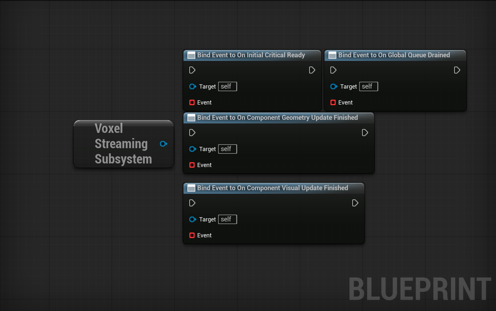

## Streaming Subsystem Delegates

The Streaming Subsystem exposes delegates that allow gameplay and systems to react to voxel streaming and rebuild events.

These delegates are useful for synchronization, loading gates, and performance-sensitive logic.

  	

---

### OnInitialCriticalReady

Called when all voxel components inside the **critical radius** have finished their initial geometry build.

This delegate is typically used to:
- Unblock gameplay after level start
- Enable player control
- Start AI or scripted sequences

It is triggered only once per initialization phase.

---

### OnGlobalQueueDrained

Called when the global streaming queue becomes empty.

This means:
- No voxel components are waiting for rebuild
- All scheduled streaming operations are complete

Useful for:
- Save operations
- Performance checks
- Debug or profiling logic

---

### OnComponentGeometryUpdateFinished

Called when a voxel component finishes a **geometry rebuild**.

Geometry updates include:
- Initial mesh generation
- Destruction or damage that affects topology
- Full or partial mesh rebuilds

This delegate is triggered per component.

---

### OnComponentVisualUpdateFinished

Called when a voxel component finishes a **visual-only update**.

Visual updates include:

- Visibility or streaming state changes
- Updates that do not modify geometry

This delegate is triggered per component and may occur more frequently than geometry updates.

---

### Usage Notes

- Delegates are executed on the game thread
- Delegates should be kept lightweight to avoid stalls
