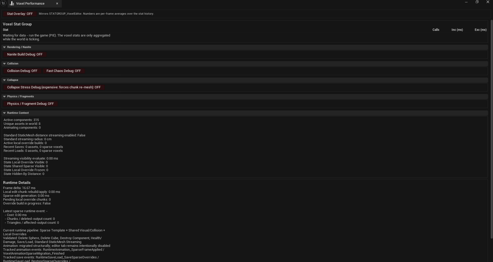

# Performance

The plugin includes built-in performance tracking for runtime sparse edits, shared visual templates, local overrides, streaming states, and save/load.

## Performance Panel

The Voxel Performance tab has three parts.

### Stat Group Mirror

The panel mirrors the STATGROUP_VoxelEditor stat group — the same numbers the `stat VoxelEditor` overlay would draw — read from the stats system instead of painted over the viewport, so the timings can be read while the game is being played.

Each row shows a voxel scope with:

- Call count
- Inclusive time (ms)
- Exclusive time (ms)

A button toggles the on-viewport overlay. In shipping/test builds where the stat system is compiled out, the table is replaced with an explanation instead of looking empty.

### Debug Switches

The panel is also the control panel for the plugin's debug console variables, exposed as ON/OFF toggle buttons:

- `voxel.PhysicsDebug` — physics and island/fragment debug draw
- `voxel.CollapseStressDebug` — publish per-voxel structural stress to the mesh (see [Physics and Destruction](11-Physics-and-Destruction.md))
- `voxel.CollisionDebug` — runtime collision debug draw
- `voxel.FastChaosDebug` — fast Chaos cooker debug
- `voxel.NaniteBuildDebug` — Nanite runtime build logging

### Runtime Snapshot

The snapshot section carries the domain context the engine stat group cannot — which asset, how many voxels, how deep the build queue is — including:

- Active components
- Unique assets in world
- Standard StaticMesh streaming state
- Active local override builds
- Operation averages
- Recent deletes, damages, saves, and loads
- Streaming visibility evaluation time
- Runtime stream state counts
- Pending local override chunks
- Recent sparse runtime events

## Runtime Pipeline Metrics

The current runtime pipeline is:

Sparse Template + Shared Visual/Collision + Local Overrides

Important metrics:

- Shared visual cluster count
- Shared visual triangle count
- Shared collision cluster count
- Local edit chunk rebuild/apply time
- Sparse edit generation time
- Pending local override chunks
- Override build in progress
- Recent delete, damage, save, and load events

## Blueprint Snapshot

GetVoxelPerformanceSnapshot exposes performance data to Blueprint.

Use it for:

- Runtime debug UI
- QA maps
- Automated performance checks
- Gameplay gates that need to wait for voxel work

## Session Logs

Runtime performance session logs are controlled by Project Settings > Voxel Editor.

- Enable Runtime Performance Session Logs writes a compact report to Saved/VoxelEditor/PerformanceLogs when PIE stops.
- Capture Runtime Performance Tick Timeline includes per-tick timeline entries.

Keep tick timeline capture disabled for smaller logs unless detailed profiling is needed.

## Optimization Tips

- Use Nanite runtime rendering for dense visual assets and large static environments.
- Use Standard StaticMesh rendering when explicit distance hiding/freezing is required.
- Increase Runtime Sparse Visual Cluster Size to reduce shared component count.
- Lower Runtime Sparse Edit Chunk Size for more localized destruction updates.
- Keep Runtime Override Build Budget Ms low enough to avoid frame spikes.
- Limit Runtime Override Max Active Builds Per Frame when many voxel actors can be edited at once.
- Prefer component-specific Blueprint functions when the target component is already known.
- Use async save/load functions for worlds with many voxel components.
