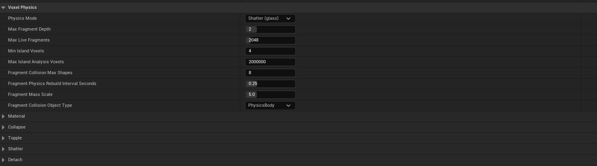
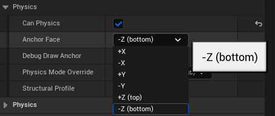
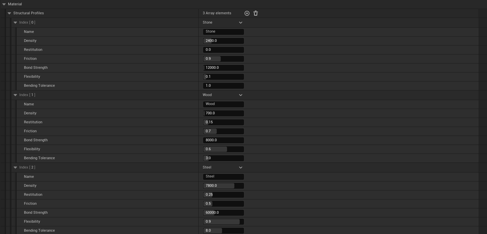
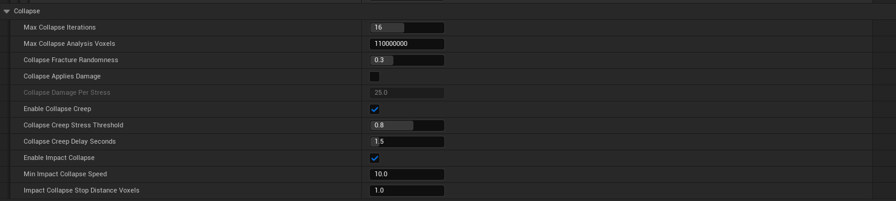
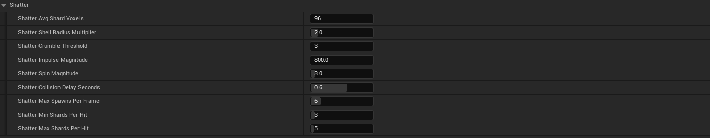
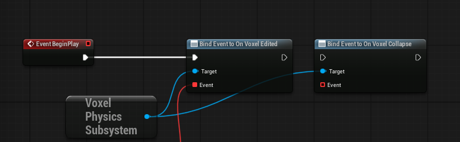

# Physics and Destruction

The plugin resolves what happens to a voxel object after it is cut, damaged, or hit. It detects the pieces that break off, spawns them as simulated fragments, and — depending on the mode — decides whether what is left can still hold its own weight, tips the object over, or fractures the area around the hit into flying shards.

Physics behaviour is project-wide and configured in Project Settings > Voxel Editor > Voxel Physics.

## Physics Modes

The plugin has four modes, selected by Physics Mode. Two are validated for production; two are still being tuned.

- **Simple** reacts only to a piece being cut off completely. While a slab still touches the structure by a single voxel, it hangs there. Detached islands become falling fragments. This mode only ever walks outwards from the damaged cells.
- **Shatter (glass)** runs no load solve: every destroy or impact fractures the ring of voxels around the hit into random shards that fly off, the way glass breaks. It is local and fixed-cost — O(voxels near the hit), not O(object) — so it stays cheap on the large objects the structural modes bog down on. It still detaches islands like Simple does, so a piece cut clean off still falls; what it does not do is ask whether what is left can carry its own weight. It also drives the ImpactShatter Blueprint nodes.
- **Collapse (structural)** — *work in progress.* Also asks whether what remains can carry its own weight, so the same slab gives way once too little is left under it. This runs a structural solve of the whole anchored object on a worker thread.
- **Topple (tipping)** — *work in progress.* Treats the whole standing object as one rigid body: while its centre of mass stays over the base it holds, but cut enough out from under one side and the object tips over and falls as a single piece, the way a felled tree or a toppled pillar does. It never asks whether the internal bonds can carry the load — only whether the object can still balance on what it stands on.

> **Work in progress:** Collapse and Topple are functional but their runtime performance on large objects has not been fully evaluated for this release. For production, use **Simple** or **Shatter** — the two modes validated so far. The Collapse and Topple sections below document the intended behaviour and settings.

Simple is the cheapest and is enough for most props. Shatter is the choice for destructible glass, masonry, and large objects where a hit should throw debris without a structural solve.

## Islands and the Anchor Face

Every mode relies on island detection. An island is one connected group of occupied voxels. Cutting a piece clean off has to drop it whatever the mode is — Shatter adds its local fracture on top of that, it does not replace it.

The Anchor Face is the face of the voxel grid bounding box that holds the object in place. The island touching that face stays; every other island is detached and falls.

- A pillar standing on the floor anchors on -Z (bottom).
- The same pillar hanging from a ceiling anchors on +Z (top).

## Fragments

Detached islands are spawned as simulated fragment actors that fall and collide.

Fragment behaviour is controlled by the Voxel Physics settings:

- Max Fragment Depth limits how many times a fragment can itself break into sub-fragments.
- Max Live Fragments caps how many fragment actors can exist at once; when it is reached, the oldest live fragment is recycled to make room.
- Min Island Voxels is the size that divides a piece worth simulating from debris that just crumbles: an island with at least this many voxels breaks off as a fragment, a smaller one is removed on the spot and announced on the edit feed for VFX. (This is the island-mode counterpart to Shatter's Crumble Threshold.)
- Max Island Analysis Voxels caps how many voxels one island search may visit on the worker thread. Set it above the voxel count of the largest object that should break apart.
- Fragment Collision Max Shapes bounds the collision cost of a single fragment.
- Fragment Physics Rebuild Interval Seconds throttles how often a fragment rebuilds its collision as it loses voxels.
- Fragment Mass Scale scales the computed mass.
- Fragment Collision Object Type sets the collision channel fragments use.

Fragments carry a self-contained save format, so a destroyed and fragmented object can be saved and restored.

### Debris Settling (Sleep)

A pile of resting debris is the worst case for physics sleeping: pieces lean on each other and trade tiny contact impulses forever, each one jiggling just enough to keep the whole pile awake. Hundreds of visually static pieces then keep costing solver time indefinitely.

The plugin settles piles itself, in two layers:

- Fragments get a more generous sleep threshold than ordinary bodies (**Fragment Sleep Threshold Multiplier**), so a piece that is merely trembling counts as settled for the engine's own sleep test.
- A slow watchdog measures each awake piece's actual **travel** — not its momentary speed, because in-place jitter has speed but covers no ground. A piece that moves less than **Fragment Force Sleep Movement Cm** and turns less than **Fragment Force Sleep Angle Degrees** between checks (half a second apart, twice in a row) is put to sleep directly. The whole settled set is slept together in one pass, because physics sleeps by contact islands: slept one at a time, an awake neighbour would just wake each piece again — including the one wedged piece that pushes without moving, which is exactly what used to keep a chain of fragments awake forever.

A slept piece behaves like any sleeping body: a hard enough hit wakes it, it simulates normally, and the watchdog puts it back down once it settles. **Fragment Max Depenetration Velocity** caps how hard the solver separates pieces that were *spawned* overlapping (debris is born inside the object it broke off), which keeps the birth pop gentle.

The defaults (4x threshold, 2 cm, 1 degree, 200 cm/s) settle a debris field within a couple of seconds of it coming to rest. Raise the tolerances if a pile still refuses to sleep; lower them if pieces freeze while visibly sliding.

## Structural Profiles (Materials)

Structural behaviour is driven by named material profiles, configured under Voxel Physics > Material as Structural Profiles.

Each profile defines:

- **Density** (kg/m3). A voxel's mass is `Density * (VoxelSize/100)^3`. This is the one number behind both halves of the physics: what a standing structure has to carry, and what a piece weighs as it falls. Stone ~2400, wood ~700, steel ~7800.
- **Bond Strength** (N). The force one face-to-face bond can carry. A voxel holds `Bond Strength * (neighbours closer to the anchor)`. Lower it and structures crush under their own weight sooner.
- **Bending Tolerance**. How much sideways leverage the material shrugs off. It decides how far a shelf can reach before it snaps where it meets the wall. Stone barely reaches; steel reaches far.
- **Flexibility**, **Restitution**, and **Friction** tune deformation response and the physical material of spawned fragments.

A wooden wall and a steel wall of the same size fall very differently, and the profile is why.

## Collapse Settings

> **Work in progress.** Collapse's behaviour is complete, but its cost on large structures is still being profiled. Prefer Simple or Shatter for shipping content until this is finalized.

When Physics Mode is Collapse, the Voxel Physics > Collapse category controls the structural solver.

Options:

- **Max Collapse Iterations** caps how far one collapse cascades. Knocking out a support overloads the next voxel along, and so on; this bounds how far that chain is followed in a single solve.
- **Max Collapse Analysis Voxels** caps how many standing voxels a single solve may weigh, on the worker thread. Set it above the voxel count of the largest object that should be structural.
- **Collapse Fracture Randomness** adds per-voxel variation in strength (taken from a hash of position, so it is identical on every client), so breaks look irregular instead of cracking along clean geometric diagonals.
- **Collapse Applies Damage** decides whether an overstressed voxel cracks — takes damage, scaled by how far past its limit it is — before it breaks, or breaks outright. **Collapse Damage Per Stress** sets how much health it loses per solve when this is on.
- **Enable Collapse Creep**, with **Collapse Creep Stress Threshold** and **Collapse Creep Delay Seconds**, lets a structure left straining right at its limit give way on its own after a pause — the "groan, then settle and come down" behaviour — instead of holding forever at deep red.
- **Enable Impact Collapse**, with **Min Impact Collapse Speed** and **Impact Collapse Stop Distance Voxels**, lets a falling fragment break itself apart on landing: the voxels that touch the ground become its anchor and the blow is weighed against them, so how it lands decides whether it survives or shatters.

The solver ignores anything already simulating physics, so falling debris is never treated as a standing structure. Fragments break only by island detection, exactly as in Simple mode.

Collapse weighs one object at a time, and each object is anchored by a face of its own bounding box. A building assembled from one asset per floor therefore has every floor holding itself up in mid-air, and destroying the ground floor changes nothing above it. To make several assets hold each other up, link them with a Voxel Structure — see [Voxel Structures](14-Voxel-Structures.md).

## Stress Debug

Collapse can publish per-voxel stress into the mesh vertex color blue channel for visualization.

- Enable it with the console variable `voxel.CollapseStressDebug 1`, or the Physics toggle in the Performance panel.
- The contract is `R = palette`, `G = health`, `B = stress`, `A = 1`.
- Stress runs from 0 (no load) to 1 (breaking point). A voxel at 1.0 is destroyed, so 1.0 is never stable.

Visualizing stress requires the base material (`M_VoxelBase`) to read the blue channel. Publishing stress re-meshes the chunks whose stress changed, so keep it off outside debugging.

## Topple Settings

> **Work in progress.** Topple is functional but not yet performance-evaluated on large objects; treat it as a preview.

Topple is a whole-object balance test, not a per-bond stress solve: it asks only whether the standing object's centre of mass is still over the patch it rests on. When enough is cut from under one side, the object tips about that edge and falls as a single rigid piece. The Voxel Physics > Topple category tunes it:

- **Topple Min Voxels** — the fewest standing voxels an object needs before Topple weighs it at all. Below this it is rubble, not a structure, and is left alone.
- **Topple Margin Voxels** — how far past the edge of its base the centre of mass must travel before it goes over, in voxels. Zero is the exact physical line; a small positive value is slack that stops an object settled on the edge from flickering between standing and falling.
- **Topple Angular Speed (rad/s)** — the initial spin handed to the body as it tips about the edge. It only has to break the balance; gravity does the rest of the fall, so keep it modest.
- **Topple Shatter On Impact** — off, the object lands as one whole rigid body, like a felled tree; on, the landing is weighed like a Collapse fragment, so a big enough object breaks where it strikes (more spectacular, and more expensive).

## Shatter

Shatter is a local fracture with no load solve — it never weighs the object or asks whether what remains can carry itself. When a destroy or damage happens in Shatter mode (or an ImpactShatter node fires), the shell of voxels around the hit is partitioned into random, connected shards, and each shard flies off as a simulated fragment. Because the fracture only ever touches the voxels near the hit, its cost does not grow with the size of the object, which is what makes it usable on large models where the structural modes bog down.

Island detection still runs, once per hit, after the shards have been torn out. That is what makes a piece the fracture cut loose actually fall — eat through the middle of a beam and its far end is now a separate island, and it drops. Islands are cheap and incremental (the search only ever walks outwards from the damage), so this does not change Shatter's cost profile.

The Voxel Physics > Shatter category tunes the break:

- **Avg Shard Voxels** — mean voxels per shard. Smaller shatters into more, finer pieces (glass); larger into fewer, chunkier blocks (masonry). Sizes vary around the mean so the break does not look uniform.
- **Shell Radius Multiplier** — how far past the destroyed radius the fracture reaches, as a multiple of it. At 3, a 100 cm delete fractures the ring out to 300 cm. The core is already gone; the shell between the hole and this radius is what breaks into shards.
- **Min / Max Shards Per Hit** — a floor and ceiling on how many pieces one hit makes, independent of its size. The ceiling keeps a wide fracture on a solid from bursting into dozens of pieces (and bodies); the floor keeps a thin wall from breaking into a single disc.
- **Crumble Threshold** — shards smaller than this crumble away as dust (announced on the edit feed for VFX) instead of spawning a physics body, so one hit cannot flood the world with tiny fragments.
- **Impulse Magnitude** and **Spin Magnitude** — how hard shards are thrown outward from the centre, and how much they tumble. The spin uses the same seed on every client, so the break matches across the network.
- **Max Spawns Per Frame** — how many shard bodies are built per frame. A big fracture removes its voxels at once, but spreads the (more expensive) body creation over the next few frames so the hit does not spike a single frame.
- **Collision Delay Seconds** — a shard is born inside the source's still-solid collision, so for this long it flies with its collision responses off — passing through the object and the other shards — then they switch back on once it has cleared the crater.

Shards are deterministic from the impact position, so every networked peer computes the same break. In multiplayer the shard **bodies** are additionally server-authoritative: the server spawns them and their movement replicates, so every player sees the same pieces land in the same places — automatically, with no setup. See [Networking and Replication](12-Networking-Replication.md).

The **ImpactShatter** Blueprint nodes (`ImpactShatter_Sphere`, `ImpactShatter_OnComponent`) fracture an area on demand without a destroy — a bullet cracking a pane, for instance — regardless of the object's Physics Mode. They still respect the object's physics flag, so a piece marked non-physical is never shattered.

## Voxel Physics Subsystem

The Voxel Physics Subsystem is a per-world subsystem that raises an event for every voxel edit, so gameplay can react from one place.

Get it with GetVoxelPhysicsSubsystem (World Context). It is null outside a game world.

It exposes two Blueprint-assignable delegates:

- **On Voxel Edited** fires once per edit — destroy, damage, or either kind of collapse — after the world is in its new state. Bind this to gather all voxel edits in one place. The event carries the edit type, the affected component, the destroyed and damaged voxel payloads, and the edit origin/radius.
- **On Voxel Collapse** fires once per collapse only, after the voxels have already broken or been damaged. It carries the collapse cause (Structural or Impact), peak stress, and impact location/speed.

On Voxel Edited exists because a collapse is the one kind of destruction nothing asked for: a shot is answered by the Blueprint that fired it, but a wall that gives way three seconds later on a worker thread's say-so has no caller to return to. On Voxel Edited is where the dust, the sound, and the gameplay reaction hang.

The Destroyed and Damaged payloads are the same `FRuntimeVoxelDeleteData` the destruction and damage nodes return (world positions, colors, extras), so an existing debris or decal Blueprint can be pointed at this event unchanged.

## Usage Notes

- For production, choose **Simple** for props or **Shatter** for destructible glass, masonry, and large objects. Collapse and Topple are work-in-progress this release.
- Set the Anchor Face to match how the object is held in the world. It matters in every mode, Shatter included: it is what island detection measures "still attached" against.
- Assign Structural Profiles per material feel; Density and Bond Strength do most of the work. Shatter uses Density for shard mass even though it runs no structural solve.
- Bind On Voxel Edited once instead of wiring the output of every destruction node — it fires for Shatter breaks too.
- Collapse and Topple run authority-side and are not replicated. Shatter replicates: the fracture is deterministic per impact, and in multiplayer the debris itself is server-authoritative so it matches on every machine. See [Networking and Replication](12-Networking-Replication.md).
- A building made of several assets needs a Voxel Structure to collapse as one building. See [Voxel Structures](14-Voxel-Structures.md).
