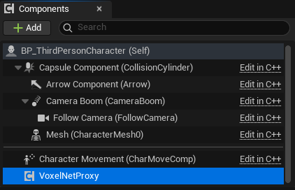

# Networking and Replication

Runtime destruction, damage, and shatter can replicate in multiplayer. The server applies an edit and every client re-runs the exact same shape locally, so the world stays in sync without ever sending voxel lists — or fragments — over the wire.

## Replication Model

Edits replicate by parameters, not by data.

- The server multicasts the edit origin, radius/extent, damage amount, and tags.
- Each client re-executes the shape against its own copy of the voxel object.
- Cell lists are never sent.

This is real-time only. There is no late-join catch-up: a client that connects after an edit does not receive it. Only voxel actors that exist identically on every machine (placed in the level, or replicated runtime-spawned actors) stay in sync.

## Setup: Client Proxy Component on the Pawn

A world-space delete or damage node called on a client has to reach the server. To let it, add the **Voxel Net Proxy Component** to the player.

Steps:

1. Open your PlayerController Blueprint (recommended) or your Pawn Blueprint.
2. Add Component > Voxel Net Proxy Component.
3. No configuration is required. Its presence is the opt-in.

Why the PlayerController: a Server RPC only routes from an object the calling client owns, and voxel actors in the world are not owned by any player. A component on the PlayerController is net-owned by that client's connection, so its Server RPC routes correctly. The Pawn works too when it is the client's possessed pawn.

Without the component, a world-space node called on a client applies locally as a cosmetic-only effect and logs a warning once. The server and standalone always behave normally.

## Server Relay

The plugin spawns one always-relevant relay actor on the server automatically at world begin play. It is internal, not placeable, and needs no setup.

It exists because a single always-relevant actor is the only way a multicast reaches every client in one global order. Replicating each voxel component instead would let net-relevancy cull edits for distant components and desync them permanently, with no resync path.

## What Replicates

- World-scoped nodes replicate: DeleteVoxel_Single, DeleteVoxel_Sphere, DeleteVoxel_Box, ApplyDamageToVoxels_Unique, ApplyDamageToVoxels_Sphere, ApplyDamageToVoxels_Box, both tag variants, and **ImpactShatter_Sphere**.
- Component-specific `*OnComponent` nodes do not replicate — a single component reference cannot be sent over an RPC — so these, including **ImpactShatter_OnComponent**, stay local by design.
- Collapse and Topple are not replicated; they run authority-side only. Both are work-in-progress this release — see [Physics and Destruction](11-Physics-and-Destruction.md).

## Physics Modes and Fragments

How a physics mode behaves on the network depends on the mode:

- **Simple** and **Shatter** replicate. The edit that drives them — a destroy, a damage, or an ImpactShatter — is multicast by parameters, and each peer re-runs the detachment or fracture against its own copy of the object.
- **Collapse** and **Topple** are authority-side only and do not replicate this release. The structural solve runs on the server; clients are not driven from it. (Both are work in progress.)

**Fragments are never replicated — by design.** A shatter or a detachment can spawn dozens of fragment actors, and streaming them and their per-frame physics over the wire would be both expensive and fragile. Instead the break is made **deterministic**: every random choice — which cells seed which shard, the outward velocity, the spin — is drawn from a seed derived from the impact position, so every machine runs the identical fracture and produces byte-identical debris without a single fragment crossing the network. Both `ImpactShatter_Sphere` and Shatter-mode destroy/damage rely on this.

There is an important consequence for the shatter nodes: `ImpactShatter_Sphere` makes the break **without a delete of its own** — the impact fractures the surface into flying shards rather than carving a hole — yet it still replicates, because the fracture is reproduced from the origin on every peer rather than sent. For that reproduction to match, the impact origin is replicated at full precision (not net-quantized), and the fragment actors themselves are never set to replicate.

## Reading Results on Clients

On a client without authority, a replicated node's output pins come back empty, because the edit is applied later through the server's multicast.

Read the per-voxel results from the Voxel Physics Subsystem On Voxel Edited event instead. It fires on every machine after the edit is applied and carries the destroyed and damaged voxel data. See [Physics and Destruction](11-Physics-and-Destruction.md). The server and standalone still fill the output pins normally.

## Tags Must Match

Tag-based edits read Actor tags locally on each machine with Actor Has Tag, so tags must be identical on the server and every client.

- Use design-time tags: set on placed actors or class defaults.
- A tag added at runtime on the server does not replicate by default, which would make clients resolve a different radius and desync.

## Usage Notes

- Add the Voxel Net Proxy Component to the PlayerController once, early in the project.
- Drive gameplay reactions from On Voxel Edited so client and server share one code path — it fires for destroy, damage, and shatter alike.
- Keep replicated edits on world-scoped nodes; use `*OnComponent` nodes only for local, non-networked effects.
- Use ImpactShatter_Sphere (not the _OnComponent variant) when the break has to appear on every client; the debris is reproduced locally on each peer, never sent.
- Collapse and Topple are authority-side only this release — do not depend on them being visible on clients.
- Do not rely on replicated destruction for late joiners; it is real-time only.
