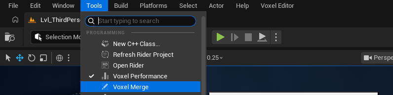
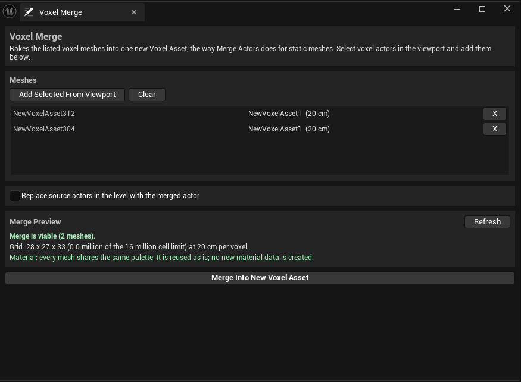

# Voxel Merge Tool

Several voxel actors can be baked into one new Voxel Asset — the plugin's counterpart to Unreal's **Merge Actors** window. A set of modular props assembled in the level, a finished building, a cluttered corner of set dressing: once it no longer needs to be separate pieces, one merged asset is cheaper to render, stream, and destroy than many small ones.

The merge is an authoring tool, not a runtime one: it reads what the meshes were built as, not what is left of them after something shot at them, and writes a new asset package. Whether the level itself changes is a checkbox.

## Opening the Tool

Open it from the main menu: **Voxel Editor → Voxel Merge**. It opens as a dockable tab, like the Voxel Performance panel.

## The Mesh List

The tool works on a list of voxel meshes taken from the level.

- **Add Selected From Viewport** — adds every actor currently selected in the level viewport that has a Voxel Component with an asset. Voxel Actors and hand-placed Voxel Components on other actors both qualify; anything else in the selection is skipped and the tool says how many.
- **X** (per row) — removes one mesh from the list.
- **Clear** — empties the list.

Each row shows the actor, the asset it uses, and its voxel size. The list holds references, not copies: if a mesh is moved or edited after being added, the merge uses where it is *now*.

## Merge Preview

The panel says whether the merge is viable **before** anything is built, and updates as the list changes. **Refresh** re-measures after meshes were moved or edited.

Three things are reported:

- **Viability** — whether the merge can run at all. The one hard limit is the merged grid: a single asset caps at 16 million cells, and meshes that are very far apart or use a very small voxel size can ask for more than that. The preview shows the grid it would build and how much of the budget it uses.
- **Voxel size** — when the meshes do not all use the same voxel size, the smallest wins and coarser meshes are resampled. The other way round would throw away detail with no way to get it back.
- **Material** — what happens to the palette:
  - Every mesh shares the same palette → it is reused as is. No new material data is created.
  - The meshes use different palettes → a dedicated palette is created for the merged asset, and the preview says how many of the 256 colour slots it needs. The new palette is saved beside the asset and does **not** consume a slot in the project-wide palette list.
  - More than 256 distinct colours → a voxel indexes one byte, so the extra colours are approximated to the closest kept one. The preview warns before you commit to it.

## Replacing the Source Actors

**Replace source actors in the level with the merged actor** — off by default.

- **Off** — the level is untouched. The merge only writes a new asset to the content browser.
- **On** — after the merge, a Voxel Actor using the merged asset is spawned exactly where the sources sat, and the source actors are deleted. The replacement is one undoable transaction.

## Merging

**Merge Into New Voxel Asset** asks where to save, builds the asset, saves it, and syncs the content browser to it. The summary appears in the panel: grid dimensions, voxels written, what happened to the palette, and any warnings.

What carries over:

- **Voxel health** is preserved per voxel.
- **Physics defaults** (Can Physics, Anchor Face, Structural Profile) come from the first mesh in the list.
- Where meshes overlap, the first one written wins, so the result does not depend on the order of the list.
- A mesh rotated at an odd angle is rasterised by its voxels' full extents, so it comes out solid, not full of holes.

## Notes

- The same merge engine also powers **Merge Into New Voxel Asset** on the Voxel Structure actor, which bakes that structure's member list directly — see [Voxel Structures](14-Voxel-Structures.md). The tab is the general-purpose version: any meshes, viewport selection, optional level replacement.
- The merged asset opens in the Voxel Asset Editor like any other and can be hand-edited from there.
- Merging is destructive to nothing until the replace checkbox is on: with it off, running a merge twice just writes two assets.
